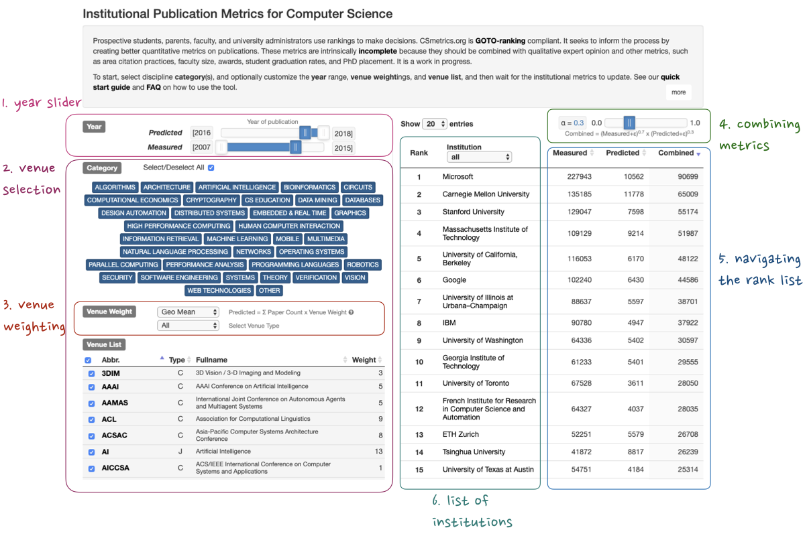

# csmetrics.net

> This repository hosts documentation and code for the webapp behind csmetrics.net.
> Last updated on 2023 June 1.

# Table of Contents

* [Quick start guide](#quickstart)

* [Summary of methodology and data processing](docs/Overview.md) -- opens a separate document

* [Frequently asked questions](docs/FAQ.md) -- opens a separate document

* [List of ideas](docs/ideas.md)
  CSmetrics is an open source project, we are waiting new developers to contribute.
  Also check [open issues](https://github.com/csmetrics/csmetrics.net/issues?q=is%3Aopen+is%3Aissue+label%3Aenhancement) for the system enhancement.

* [Site developer instructions](#pushreq)

## Quick start guide for CSmetrics.net

**Defaults** Load the page and then wait for the institutional metrics to update a combined aggregated metric (both measured and predicted) for 15498 institutions (academic and industry) for papers published in 2007 to 2022 at 231 conferences and 92 journals.

Figure 1. Quick Start User Guide.

1. **Year slider** Use this slider to change the year range of the measured (citations, retrospective) and predicted (prospective) metrics. By default the two ranges are mutually exclusive, click the slider to unlock and adjust the two year ranges independently.

2. **Venue selection** Click each area keyword to toggle inclusion/exclusion of conferences in the corresponding area. The list of conferences on the lower left and the list of acronyms on the right will update correspondingly. Use the check boxes on the left to select or deselect individual conferences.  We have currated [a list of CS conference/journal venues and their categories](https://github.com/csmetrics/csmetrics.net/blob/master/app/data/venue_list.csv).  Submit a pull request to propose edits to the venues.

3. **Venue weighting** The default venue weight is the [geometric mean of the citations for all papers in the venue from 2007 to 2022](https://github.com/csmetrics/csmetrics.net/blob/master/app/data/venueWeightNote.md). You can change the weight to equal (i.e., each conference has a weight of 1.0) with the “Venue weight” dropdown box on the right.

4. **Combining metrics** The α slider changes the relative geometric weighting of the measured versus predicted metric. We add a small constant ε to prevent invalid values when an institution has zero publications in a venue.

5. **Navigating the institution list** The webpage updates instantly when you: change the venues, years, or  α, change the list of institutions being ranked, change the entries per page, and flip pages.

6. **List of institutions**  Because authors do not identify their institutions uniformly, we use [OpenAlex]([https://www.microsoft.com/en-us/research/project/microsoft-academic-graph/](https://docs.openalex.org/) for cleaning institution names and aliases.

7. **Contributions and Feedback** This version is a pre-release and we welcome feedback. Changes are gladly reviewed and accepted via pull requests, other discussions and feature requests should be submitted as [github issue](https://github.com/csmetrics/csmetrics.net/issues)

## Instructions for making edits

This project is written in **python3** with the **Django** web framework.

1. Fork and clone this repository
2. Install Django and other requirements `$ pip install -r requirements.txt`
3. Run the server: `$ ./run_server.sh`
4. Access the server: http://localhost:8000
5. Make and test changes locally
6. Push changes to your fork and submit a pull request.

 This work is licensed under a <a rel="license" href="http://creativecommons.org/licenses/by/4.0/">Creative Commons Attribution 4.0 International License</a>.
