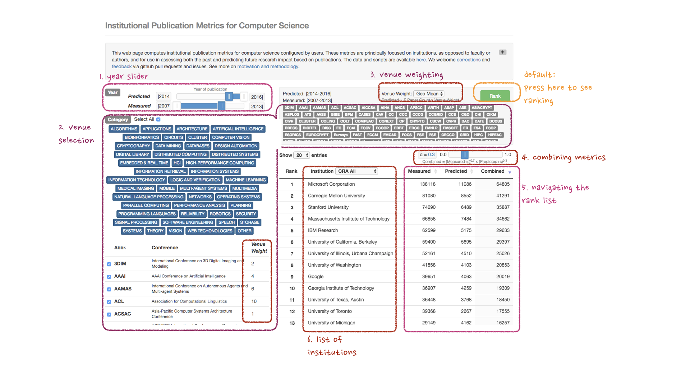

# csmetrics.org

> This repository hosts documentation and code for the webapp behind csmetrics.org. 

# Table of Contents

* [Quick start guide](#quickstart)

* [Instructions for making edits](#pushreq)

## Quick start guide for CSmetrics.org

**Defaults** Load the page and then press the green 'Rank' button to produce a combined aggregated metric (both measured and predicted) for 199 CRA member institutions (academic and industry) for papers published in 2007 to 2016 at 210 conferences. 

Figure 1. Quick Start User Guide.

1. **Year slider** Use this slider to change the year range of the measured (citations, retrospective) and predicted (prospective) metrics. By default the two ranges are mutually exclusive, click the slider to unlock and adjust the two year ranges independently.

2. **Venue selection** Click each area keyword to toggle inclusion/exclusion of conferences in the corresponding area. The list of conferences on the lower left and the list of acronyms on the right will update correspondingly. Use the check boxes on the left to select or deselect individual conferences.  We have currated [a list of CS conference venues and their categories](https://github.com/csmetrics/csmetrics.org/blob/master/app/data/venue_category.csv).  We will add CS journals soon. Submit a pull request to propose edits to the venues. 

3. **Venue weighting** The default venue weight is the [geometric mean of the citations for all papers in the venue from 2007 to 2016](LINK TBD). You can change the weight to equal (i.e., each conference has a weight of 1.0) with the “Venue weight” dropdown box on the right. 

4. **Combining metrics** The α slider changes the relative geometric weighting of the measured versus predicted metric. We add a small constant ε to prevent invalid values when an institution has zero publications in a venue. 

5. **Navigating the rank list** The webpage updates instantly without having to press the ‘Rank’ button when you: change the list of institutions being ranked, change the entries per page, and flip pages. Otherwise, if you change the venues, years, or  α, you need to select 'Rank' again. 

6. **List of institutions**  Because authors do not identify their institutions uniformly, we combined institutational aliases with some automation and by hand for the [CRA member institutions](https://github.com/csmetrics/csmetrics.org/blob/master/app/data/member_list.csv). We are currently curating and combining aliases for an international list containing thousands of institutions.  More details on how we cleaned the data are [here](LINK TBD).

7. **Contributions and Feedback** This version is a pre-release and we welcome feedback. Changes are gladly reviewed and accepted via pull requests, other discussions and feature requests should be submitted as [github issue](https://github.com/csmetrics/csmetrics.org/issues)

[Overview doc](docs/Overview.md)

## Instructions for making edits

This project is written in python3 with the Django web framework. 

1. Fork and clone this repository
1. Install Django and other requirements `$ pip install -r requirements.txt`
1. Run a local server
  1. Setup env: `$ ./python manage.py migrate`
  2. Run the server: `$ ./run_server.sh`
  3. Access the server: http://localhost:8000
1. Make and test changes locally
1. Push changes to your fork and submit a pull request. 
