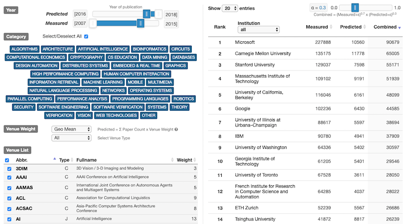
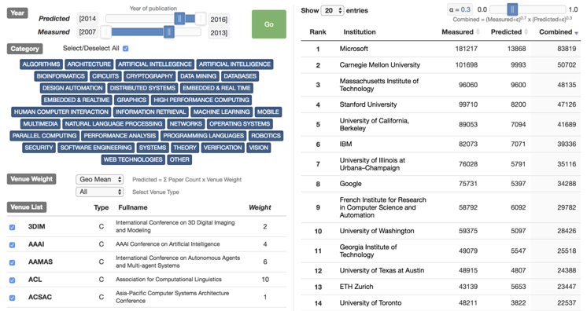

# CS Metrics 2019 Edition

> Last updated 10 July 2019

## A. Summary of main system and data changes

### 1. Paper filters for DBLP

[Current - July 2019]
* 2007 to 2018 appearing in 221 conferences and 87 journals from 6466 institutions.
* Filters for conferences: `['senior member',"what's hot", "invited", 'doctoral', 'demo', 'demonstration', 'keynote', 'student','speaker', 'tutorial', 'workshop', 'panel','competition', 'challenge']`
(Note: Short, Poster and Oral keywords are removed)
* We use the page numbers to filter short papers -- see [here](https://github.com/csmetrics/csmetrics.org/blob/master/docs/Overview.md#filtering) for more details. Among the five options, we choose 'Header + Page Num (k)' filter. The minimum page length is 4.
* Filters for journals: `['editor', 'special issue','state of the journal', 'in memory']`

[Previous - Sep 2017]
* 2007 to 2016 appearing in 209 conferences and 80 journals from 6466 institutions.
* Filters for conferences: `['Workshop', 'Tutorial', 'Demo', 'Keynote', 'Panel', 'Senior Member', 'Short', 'Poster', 'Oral', 'Student', 'Doctoral ', 'Speaker', "What's Hot", "Invited "]`
* We consulted experts familiar with these conferences regarding such exceptions:
A small number of venues included full papers under ‘Oral Presentations’ or under ‘Poster Presentations,’ because they were misclassified by the data source.
* Filters for journals: `['Editor', 'editor', 'special issue', 'Special Issue', 'State of the Journal', 'state of the journal', 'In Memory']`.

### 2. Method for querying for citations

[Current - July 2019]
* We use MAG data dump (2019-01-01 version) to query paper titles.
2.47% of the papers did not match from title search.

[Previous - Sep 2017]
* We sent the Microsoft’s API only the title because it does not have every paper linked to an author and/or affiliation.
Microsoft Academic did not match about 2.5% of our title searches.

### 3. Added new venues and categories

Updated venue list: [venue_list](https://github.com/csmetrics/csmetrics.org/blob/master/app/data/venue_list.csv)

New categories added:
* COMPUTATIONAL ECONOMiCS
* SOFTWARE VERIFICATION
* CS EDUCATION

### 4. UI changes

“Go” button is removed. Each time users make a new selection, the ranking updates interactively.
Search bar is added to the ranking list (right).
Select all checkbox is added to the venue list (left).

[Current - July 2019]

[Previous - Sep 2017]

