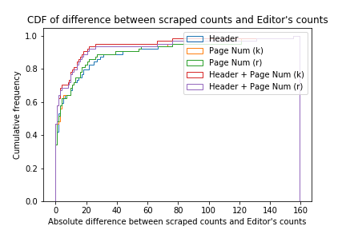

# Institutional Publication Metrics for Computer Science

## Motivation

Rankings highly influence students, faculty members, and institutions.   Whether Computer Science wants to be ranked or not, it will be ranked.  

University research, like so many other accomplishments, is complex and multi-dimensional, and hence hard to measure.  In addition, many things that we care about, such as impact, reputation, and alumni success, take time to manifest.  Consequently, it is hard to know how well an institution is doing at present and whether an institution is on an upward or a downward trajectory. We seek to address this challenge and to improve the quality of data and analytical tools available to Computer Science (CS) deans, chairs, faculty, students, departments, institutions, such that they can inform decision-making and institutional comparisons by combining quantitative metrics with expert qualitative opinions, recognizing that neither opinion, data, or metrics will ever be perfect.

Although judging research quality is hard, science judges itself and scientific progress, almost universally, by combining expert qualitative opinion with quantitative metrics.  Our tool focuses on quantitative publication metrics for 2007-2018.  Because all big data is dirty, we spent considerable time cleaning the data we gathered from [DBLP](http://dblp.uni-trier.de) and [Microsoft Academic Search](http://academic.research.microsoft.com) which sources its data from ACM, IEEE, and other publishers. We cleaned publication venue, citations, and institutional data for over 221 conferences and 87 journals.  We describe our data cleaning process and metrics in more detail below in [Methodology](#methodology).  

We develop a simple model that predicts the future citations of a paper at the time of its publication, and use this as a forward-looking metric of institutional accomplishment, in terms of computing-related publications. We use a retrospective metric (citations) and a predictive metric (for very recent publications, where each publication may be weighed by a measure of venue strength).

[Below](#other) we describe how our approach differs from efforts such as [U.S. News & World Report](https://www.usnews.com/best-graduate-schools/top-science-schools/computer-science-rankings), which only uses opinions, [Computer Science Rankings (beta)](http://www.csrankings.org), which counts papers in selected venues for current faculty, and [Scholar Ranking](http://www.dabi.temple.edu/~vucetic/CSranking/), which uses citations and productivity for current faculty. These other tools include important metrics such as faculty size and individual faculty productivity and citations.  We focus on institutional metrics that credit all authors with work performed at an institution. In our tool, individual faculty’s credit does not move with them. Publications never change institutions.  We use both retrospective and predictive metrics.

Publications, and citations to these publications, are time-honored ways in which to quantify research accomplishments.  While these metrics are imperfect, we think that they are likely to be substantially superior to subjective guesses.  We note that our tool is intrinsically [incomplete](#limitations) because it does not include other important metrics, such as, count of faculty, research test-of-time awards, faculty honors, PhD placement,  funding, and expert opinions. Some of these quantitative metrics are available elsewhere, but for now they are outside our scope.

## Table of Contents
* [Methodology](#methodology)
* [Cleaning the data](#cleaning)
* [Metrics](#metrics)
* [Limitations](#limitations)
* [Other Methods and Tools for CS Metrics](#other)
* [Your support and opinion counts](#survey)
* [Contributors](#contributors)
* [Acknowledgements](#ack)

## Methodology

We organize computing publication data by venue, author institution, and citations.   We currently have 221 conferences and 87 journals. Our intention is to include all computing research venues that use a rigorous peer-review process.  We currently present 6231 institutions that our tools identified as participating in CS research world-wide.

The next section first describes more on why and how we cleaned publication data, and then describes our analysis and metrics based on this data.

### Data cleaning

Publication data is available from many sources, including [DBLP](http://dblp.uni-trier.de), [Google Scholar](https://scholar.google.com), [Microsoft Academic](https://academic.microsoft.com/), and publishers such as [ACM](http://dl.acm.org) and [IEEE](http://ieeexplore.ieee.org/Xplore/home.jsp), but unfortunately as with all big data, this publication and citation data is dirty. Careful examination of ACM and IEEE publication data, and sources derived from them (e.g., DBLP, Google Scholar, and Microsoft Academics) showed numerous systematic and one-off errors that resulted in orders of magnitude differences in publication counts for some venues.  For example, we found instances where all of the papers in a major conference (e.g., OOPSLA and ICSE) with a rigorous peer review processes were grouped together and made indistinguishable from very large numbers of unrefereed posters and publications at satellite workshops with different submission and editorial processes.  Any publication-related metrics can reliably be computed only after the data are cleaned.

#### Choice of venues

We chose to include 221 conferences and 87 journal venues. Computing research topics, publication practices, and citations practices are changing rapidly.  For instance, new areas are emerging as interdisciplinary and computing research evolves and flourishes.  Including new venues and small research areas to encourage and help emerging topics flourish is critical to rewarding interdisciplinary work and accelerating innovation.  We thus chose an inclusive list of venues, all of which use a rigorous peer-review process with 3 or more reviews for each submitted paper.  

In other words, our complete set of venues may be larger than many users would like.  As such, we give users the option to leave out any venues that they would prefer not to include.  Note that adding new venues will require  cleaning and processing the data, but we welcome these additions using a [github pull request](https://github.com/csmetrics/csmetrics.org).

#### Cleaning publication to venue mapping

From DBLP, we downloaded the HTML file for each conference/journal considered for every year/volume in our data range of interest (2007-2018). From this HTML file, we extracted paper titles, and additional information, such as page length, authors, etc.). From this list we identified papers, which we defined as full research papers at the venue that were selected through the same editorial process (e.g., submission, peer reviewing, revision, etc.)

For the conferences, we used section headers in DBLP to filter out workshop papers, demonstrations, tutorials, and everything else other than referred papers. The filter that we used searched for section headers and excluded documents with any of the following keywords: ['senior member',"what's hot", "invited", 'doctoral', 'demo', 'demonstration', 'keynote', 'student','speaker', 'tutorial', 'workshop', 'panel','competition', 'challenge'].
For the journals, we excluded documents with the following keywords: ['editor', 'special issue','state of the journal', 'in memory'].

We use the page numbers to further filter short papers -- see [different filtering methods for comparison](#filtering). Among the five options, we choose 'Header + Page Num (k)' filter. The minimum page length is 4.

#### Different filtering methods for comparison

Five different filtering methods are considered:

* `filter_by_header 'Header'`: This method uses information contained in the header of the section the paper was scraped from. Specifically, if the section header for a paper contains particular keywords then that paper will be excluded. Not all venues are divided into sections on DBLP and in cases where there are papers without section headers, all such papers are included.

* `filter_by_page_number_keep_missing 'Page Num (k)'`: This method uses information about the pagination for the paper as scraped from DBPL with the rest of the paper information. The pagination which is pulled from the webpage HTML and stored as a string is parsed into a start and end page number. Using these numbers, the length of the papers is determined and papers are included if they meet a minimum page length. The keep_missing and (k) in the function name and legend label for this filter refer to the method used for dealing with papers for which pagination information could not be validly formatted into a start and end page. In this instance, papers without valid pagination are included (i.e. are not removed by the filter).

* `filter_by_page_number_remove_missing 'Page Num (r)'`: This method is the same as filter_by_page_number_keep_missing with the exception that papers for which pagination information could not be validly formatted are not included (i.e. are removed by the filter).

* `filter_by_header_and_page_number_keep_missing 'Header + Page Num (k)'`: This method first applies the filter_by_header method described above, and then applies the filter_by_page_number_keep_missing method to the remaining papers. This means that the resulting papers are the intersection of the papers that pass each of these filtering methods.

* `filter_by_header_and_page_number_remove_missing 'Header + Page Num (r)'`: Similarly, this method first applies the filter_by_headermethod described above, and then applies the filter_by_page_number_remove_missing method to the remaining papers. Again, this means that the resulting papers are the intersection of the papers that pass each of these filtering methods.

We test the filtering methods using the random sample of (conference,year) tuples (~70) from [conference_samples](conference_samples.csv). The Figure below shows the cumulative fraction of a modest set of (conference, year) tuples with respect to the difference between the differences between what the systems finds and the editors’ input in proceeding foreword.

Figure 1. Filtering count comparison

#### Extra scraping for missed papers
Papers for some venues were not accurately retrieved in the scraping process for a number of different reasons.
We investigated the venues with many years of zero paper counts, and did the extra scraping for the missed papers. See this [notebook](https://github.com/csmetrics/csmetrics.org/blob/master/data/get_and_clean_DBLP_papers.ipynb) for more details.

* **Case 1) Venues with different keys used in our database compared to the key used by DBLP.**
A list of venues where the keys contained in [venue_list](https://github.com/csmetrics/csmetrics.org/blob/master/app/data/venue_list.csv) are not the same as the key used by DBLP to represent the same venue is contained in [venues_with_different_dblp_keys](https://github.com/csmetrics/csmetrics.org/blob/master/data/venues_with_different_dblp_keys.csv).

* **Case 2) Venues that did not fit the general DBLP url template.**
A list of conferences* where the url for the DBLP data did not fit the simple format matched by most conferences, that is `https://dblp.org/db/conf/{key}/{key}{year}.html`, can be found at [venues_with_different_dblp_baseurls](https://github.com/csmetrics/csmetrics.org/blob/master/data/venues_with_different_dblp_baseurls.csv). Generally this occurs where DBLP has group multiple conferences/workshops together under one group key and then use the conference key to specify after that, i.e. `https://dblp.org/db/conf/{groupkey}/{conferencekey}{year}.html`.

  (\*) This list only contains conferences because the method used to scrape the journals makes this problem unique to the conferences. More specifically, the method for journals does not use a set template for each (venue, year) tuple because the journals are stored by volume number rather than year.

* **Case 3) Journals that needed to be retrieved through an alternative scraping method.**
A list of journals where that needed to be scraped using an alternative method is at [journals_to_use_alternative_scraping_method](https://github.com/csmetrics/csmetrics.org/blob/master/data/journals_to_use_alternative_scraping_method.csv). The webpages for these journals listed the volumes in a different way and therefore were not picked up by the standard scraping method used for most journals.

* **Case 4) Papers that have single page number in DBLP.**

We used a script to send this list of papers titles to the [Microsoft Academic Search](http://academic.research.microsoft.com) which returned for each paper its authors, affiliations, and citations. We use MAG data dump (2019-01-01 ver.) to query paper titles. Microsoft Academic did not match about 2.47% of our title searches.

#### Cleaning author to institution mapping

Because sometimes the same author or authors from the same institution do not record the name of their department, University or other institute consistently, there are many institution names that should map to the same place.  These aliases deflate the publication statistics for an institution.  When we simply mine the publication data for institutional names, we get over 6231 institutions world-wide. To clean this data, we used a script to send this list of institutional names to the [Microsoft Academic Search](http://academic.research.microsoft.com) which returned formatted interpretations. More details on how we cleaned the data are [here](https://github.com/csmetrics/csmetrics.org/blob/master/app/data/cleaningNote.md).

#### Choice of research topics

For each venue, we identified major topics it covers. The number of CS research topics is expanding and becoming increasingly interdisciplinary as computational methods are applied to new areas and in new ways. Since publication and citation practices differ substantially by CS sub-area, we think qualitative analysis must complement bibliometrics by area. In the future, it may be possible to develop a methodology for grouping and analyzing sub-areas that informs combining and comparing subareas, but we leave those kinds of metrics for future work.  We generally required an area category to include 3 or more venues, and otherwise classified it as 'other'.

### Metrics
We propose combining two metrics for the purposes of analyzing past research impact and trying to predict the future.  For past research impact, we use citations to publications. For prediction, we use paper counts and venue impact.

We start by dividing credit for each paper equally among all authors and credit it to their institution.

**Measured impact**  For each publication, we query Microsoft Academic API for all citations from any year. Each institution with an author then accrues these citations weighted by the fraction of authors at the institution. For example, a publication with 2 authors at University A and one author at University B and 100 citations, accrues 66.6 citations to University A and 33.3 citations to University B.

**Predicted impact**   More than other disciplines, CS research institutions are currently experiencing a lot of growth to meet student demand and societal workforce and innovation demands on CS.. We have thus included a predictive forward-looking metric, to understand the benefits of investment or the results of neglect.

For the predicted impact, we compute the number of papers appearing in a venue and divide the credit equally among authors’ institutions. We optionally weight this count by the geometric mean of the citations to the venue.  This weighting thus gives more potential impact to papers that appear in venues that in the past had more citations.  We use the geometric mean instead of the arithmetic mean because even in the impactful venues, many papers are not cited, many incur only a modest number of citations (which depend on the discipline and point in history), and a few are very highly cited.

### Limitations

As discussed above, we only consider publications, which are a very important piece of scholarly output, but  only a piece.  Even when considering publications, we ideally wish to measure impact rather than just count publications.  We use citations as the measure of impact, but recognize that citations do not tell the full story.

A significant challenge with using citations as a metric is that citations take time to accumulate, with significant variation across papers in citation rate over time.   For recent papers, less than 2 or 3 years old, citations are not a good way to measure impact.   We have developed and used a novel metric, based on predicted citation count, estimating this based on the venue.  

We note that the longer ago a paper was published and, similarly, the older a particular instance of a venue,  the more time they have to accrue citations.  Thus, both citations and venue weights are influenced by time, and, furthermore, publication and citations practices change over time.  As an example,  a number of venues recently eliminated page count limitations on citations.   A limitation of our current tool is that it does not consider this time varying component of the citation data with respect to a venue or an individual publication.

In our tool, credit goes to institutions based on authors affiliation(s) at time of publication and never changes,  but people move.  If a professor moves from institution A to institution B, it can be argued that B should now get (some of) the credit for the work they did while at A.  But it can equally be argued that credit should remain with the institution where the work was done, after all that was the environment that supported and enabled the work.  Students should probably not carry away with them credit for work they did at an institution that trained them.  Furthermore, institutions should not be able to “buy”  a lot of credit by hiring famous faculty past their prime.  While both these views have merit, we have chosen to adopt an immovable credit methodology, because we know we can do it correctly.  Having credit move with people requires considerable work tracking individual authors and determining their individual career stages, which we have not undertaken.

More people obviously can get more done.  When we score numbers of publications, citations, and so on, we expect larger institutions to have larger scores.  Given  the size of an institution, we could produce a normalized per person score.  However, as discussed above, it is not straight forward to count correctly the number of people to divide by. Should it be faculty, research faculty, or tenure-track faculty?  Should number of students,  post-docs, research fellows, and collaborating faculty from other departments play a role?  

A better way to address this problem might be to compute a score individually for faculty affiliated with an institution.  We could then report the score for the kth most-cited  professor for different values of k, and then adjusted by year of publication and years the faculty has been active.  The higher this score, and the deeper the bench of faculty with highly cited publications, the more likely the  institution is stronger.  

The publications data we have obtained and cleaned is only for selected publications, of necessity.  For publications related to computing, we have tried to include most international forums.  Depending on your perspective, you may choose to leave out some of these in your analysis, and the tool supports leaving venues out, to create custom lists of the venues according to your personal criteria.  If venues you care about are missing, please give us <a href="https://github.com/csmetrics/csmetrics.org/issues">feedback</a>
                via github pull requests and issues.

Interdisciplinary work is to be applauded and  encouraged,  yet, it is difficult to measure well.  With our methodology, popular venues outside the core of computing are included, to cover some amount of broadening.  However, venues completely outside Computing are not included, even if very prestigious.  Thus, for example, publications in Nature do not count.  The reason is that most publications in Nature have nothing to do with Computing.  So including Nature in our statistics will primarily reflect work by people unrelated to Computing.  If an analysis were to first identify Computing faculty and students, and then find venues from the people, it would be possible to include a  wider range of venues to better identify interdisciplinary work.

Many venues have multiple classes of publications. For example, full papers and short papers.  Our present system seeks to incude papers in a venue that undergo the same editorial process, e.g., same submission, review, and acceptance criteria. Generally for each venue, the publication should include only  refereed full research papers.  However, some short papers at very prestigious venues may be more important and impactful than full papers at less selective venues.  In future work, we plan to consider such short papers as well.

## Other Methods and Tools for CS Metrics

Unfortunately for CS, the most influential ranking source for CS graduate programs, The [U.S. News & World Report](https://www.usnews.com/best-graduate-schools/top-science-schools/computer-science-rankings), is based only on opinions. Our purpose is to provide a way to compare institutions (and influence rankings) using publication, area, and venue metrics, as well as opinions.  Our metrics have a different focus than two recent sources of rankings, [Computer Science Rankings (beta)](http://www.csrankings.org) and [Scholar Ranking](http://www.dabi.temple.edu/~vucetic/CSranking/), which evaluate current faculty.  In these systems, research impact is measured by faculty research. The research of PhD students, postdoctoral students, undergraduates, research staff, and collaborators in other departments at the same institution is not included.  If a faculty member moves between institutions, all their publications move with them. Our tool differs because all authors accrue credit to their institution at time of a paper’s publication and this credit is not moveable.   Depending on your purpose for ranking, faculty metrics and institutional metrics likely both have a place.

The [Computer Science Rankings (beta)](http://www.csrankings.org) tool uses publications counts for a small set of top venues, chosen in part based on venue average citation counts. It counts publications for current faculty with full-time tenure track appointments in the computer science department, school, or college.   While clearly the top venues by citation counts capture a lot of influential research publications, they do not always capture it.  Omitting many venues is problematic because it credits unlisted publications as worthless, making a very strong value judgement. It may further incentivize faculty to publish only in certain venues and discourage wider scientific participation. Limiting venues makes new, emerging areas very hard to capture or judge.

Numerous prestigious international research organizations, including DORA, the UK Parliament, the European Association of Science Editors, the American Society for Biology and others,  recommend strongly against using venue as a proxy for quality.  For instance,  recommendation 1 of the DORA statement reads:  “Do not use journal-based metrics, such as Journal Impact Factors, as a surrogate measure of the quality of individual research articles, to assess an individual scientist’s contributions, or in hiring, promotion, or funding decisions.”   We agree that using only counts of papers in venues for papers with sufficient time to accrue citations is not a good measure of impact, however, we note that recent publications, e.g., in the past two or three years do not have citations on which to judge them. In this limited scenario, venue reputations based on past citations to publications in that venue provide one quantitative measure of <i>potential impact</i>. Our tool makes it possible to only focus on citations or to use papers in any venue or a weighted venue for recent work as a predictive metric, rather than an impact metric.  We believe this forward-looking metric can help judge the direction of an institution, showing investments in faculty hiring, graduate student support, etc., or neglect.   

[Scholar Ranking](http://www.dabi.temple.edu/~vucetic/CSranking/) uses citations of current faculty by querying Google Scholar for the number of citations to the faculty member’s 10th most cited paper (T10 metric).  They use the median and geometric mean then weigh it by faculty rank (full and associate professors are grouped together, and assistant professors are grouped separately).  They also weigh publication credit by author order, whereas we divide it equally since some areas use alphabetic and other conventions for author ordering.  The T10 metric rewards productivity as well as citations, but minimizes the impact of the very most influential papers that accrue many citations, which seems counter-productive to understanding impact.  However, they offer a number of metrics and weights, and find that their ranking correlates well with the opinions in the U.S. News & World Report ranking.   

## Your support and opinion counts

This tool currently has no financial support and cannot continue in perpetuity or be improved without such support. We believe that this data collection and analysis activity of computer science institutions should be supported and expanded with student enrollments, graduation rates, awards, current faculty members, etc. by the community and welcome your participation.

Please fill out this [short survey](https://www.surveymonkey.com/r/csmetrics)  to tell us if the tool is useful, how you are using this information, and to influence the future of this tool.

## Contributors

* Steve Blackburn, Australian National University (ANU)
* Carla Brodley, Northeastern University
* H. V. Jagadish, University of Michigan
* Kathryn S McKinley, Google
* Mario Nascimento, University of Alberta
* Benjamin Readshaw, ANU
* Minjeong Shin, ANU
* Sean Stockwell, University of Michigan
* Lexing Xie, ANU
* Qiongkai Xu, ANU

## Acknowledgements
We thank the [Computer Research Association (CRA)](http://cra.org),  [ANU College of Engineering and Computer Science](http://cecs.anu.edu.au), and [ANU Research School of Computer Science](http://cs.anu.edu.au) for supporting the development of the data and web application. We thank [Microsoft Academic Search](http://academic.research.microsoft.com) for their help and data, and [DBLP](http://dblp.uni-trier.de) for their data.
